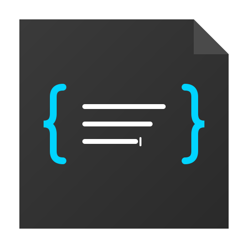

<p align="center">
  
</p>

<h1 align="center">micro.log</h1>

<p align="center">
  <strong>A minimalist micro-journaling app for desktop and web</strong>
</p>

<p align="center">
  <a href="#features">Features</a> •
  <a href="#installation">Installation</a> •
  <a href="#development">Development</a> •
  <a href="#tech-stack">Tech Stack</a> •
  <a href="#license">License</a>
</p>

<p align="center">
  
  
  
</p>

---

## About

**micro.log** is a personal journaling application designed for quick daily logging with minimal friction. Write bullet-style entries, track ideas, record dreams, and collect wisdom — all stored locally on your machine.

Available as a **desktop app** (Electron) for macOS, Windows, and Linux, or run it directly in your **browser**.

---

## Features

### Core Modules

| Module | Description |
|--------|-------------|
| **Daily Log** | Quick bullet-style entries with support for `#tags` and `@mentions` |
| **Dreams** | Dedicated space for recording and tracking your dreams |
| **Notes** | Longer-form notes for when bullets aren't enough |
| **Ideas** | Track ideas with status workflow: `new` → `in progress` → `done` |
| **Wisdom** | Collect quotes, thoughts, and lessons learned |

### Organization & Discovery

- **Tags** — Use `#hashtags` to categorize entries and browse by topic
- **People** — Mention `@people` to track interactions and relationships
- **Insights** — Statistics dashboard with activity graphs, streaks, and trends

### User Experience

- **Dark / Light Mode** — Switch themes to match your preference
- **Multilingual** — Available in English and Spanish
- **Local Storage** — Your data stays on your machine in a configurable vault location
- **Privacy First** — No accounts, no cloud, no tracking

---

## Installation

### Download

Download the latest release for your platform from the [Releases](../../releases) page:

| Platform | Formats |
|----------|---------|
| macOS | `.dmg`, `.zip` |
| Windows | `.exe` (installer), portable |
| Linux | `.AppImage`, `.deb` |

### Build from Source

```bash
# Clone the repository
git clone https://github.com/luismoralesarg/micro-log.git
cd micro-log

# Install dependencies
npm install

# Build for your platform
npm run electron:build:mac    # macOS
npm run electron:build:win    # Windows
npm run electron:build:linux  # Linux
```

---

## Development

### Prerequisites

- Node.js 20+
- npm

### Quick Start

```bash
# Install dependencies
npm install

# Run web version (browser)
npm run dev

# Run desktop version (Electron)
npm run electron:dev
```

### Available Scripts

| Command | Description |
|---------|-------------|
| `npm run dev` | Start web development server |
| `npm run build` | Build web app for production |
| `npm run preview` | Preview production build |
| `npm run electron:dev` | Start Electron in development mode |
| `npm run electron:build` | Build desktop app for current platform |

---

## Tech Stack

- **Frontend**: React 18, TailwindCSS 3
- **Build Tool**: Vite 5
- **Desktop**: Electron 28
- **Packaging**: electron-builder
- **CI/CD**: GitHub Actions (automated multi-platform releases)

---

## Project Structure

```
micro-log/
├── src/
│   ├── views/          # Main app views (Journal, Dreams, Notes, etc.)
│   ├── components/     # Reusable UI components
│   ├── contexts/       # React contexts (Language)
│   ├── hooks/          # Custom hooks (useJournal, useVault)
│   └── locales/        # i18n translations (en, es)
├── electron/           # Electron main process
├── public/             # Static assets & icons
└── .github/workflows/  # CI/CD configuration
```

---

## License

[MIT](LICENSE) © Luis Morales
